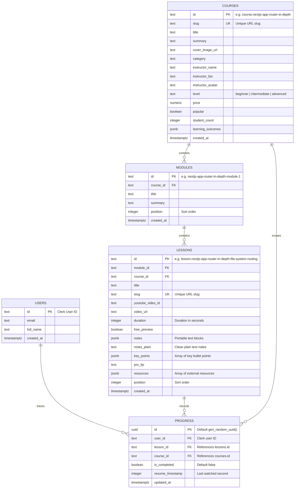

# Vibelearn: Database Design & Supabase PostgREST CRUD Architecture

- **Date:** 2026-09-26
- **Status:** Approved
- **Scope:** Supabase PostgreSQL Schema, PostgREST CRUD Services, Seeding Automation, and Progress Tracking

---

## 1. Executive Summary

This specification establishes the PostgreSQL database schema in Supabase for **Vibelearn**, configures public and protected Row Level Security (RLS) policies, provisions automated seeding from `docs/seed.ndjson` and `docs/videos.json`, and implements a comprehensive CRUD service layer utilizing `@supabase/supabase-js` that consumes environment credentials from `.env` (`VITE_SUPABASE_URL`, `VITE_SUPABASE_ANON_KEY`).

---

## 2. PostgreSQL Database Schema (Supabase)

### 2.1 Entity Relationship Diagram



### 2.2 Constraints & Indexes
- `courses(slug)`: Unique index.
- `modules(course_id, position)`: Index for fast ordering.
- `lessons(module_id, position)`: Index for curriculum loading.
- `lessons(slug)`: Unique index.
- `progress(user_id, lesson_id)`: Unique constraint for atomic `upsert` queries on resume timestamp and completion.
- `progress(user_id, course_id)`: Index for user course progress aggregation.

### 2.3 Row Level Security (RLS) Policies
- **`courses`, `modules`, `lessons`**:
  - `ENABLE ROW LEVEL SECURITY;`
  - `CREATE POLICY "Public Read Access" ON courses FOR SELECT USING (true);`
  - `CREATE POLICY "Public Read Access" ON modules FOR SELECT USING (true);`
  - `CREATE POLICY "Public Read Access" ON lessons FOR SELECT USING (true);`
- **`progress`**:
  - `ENABLE ROW LEVEL SECURITY;`
  - `CREATE POLICY "Allow anon read progress" ON progress FOR SELECT USING (true);`
  - `CREATE POLICY "Allow anon write progress" ON progress FOR INSERT WITH CHECK (true);`
  - `CREATE POLICY "Allow anon update progress" ON progress FOR UPDATE USING (true) WITH CHECK (true);`
- **`users`**:
  - `ENABLE ROW LEVEL SECURITY;`
  - `CREATE POLICY "Allow read users" ON users FOR SELECT USING (true);`
  - `CREATE POLICY "Allow insert users" ON users FOR INSERT WITH CHECK (true);`

---

## 3. PostgREST Client & CRUD Service Architecture

### 3.1 Supabase Client Initialization (`src/lib/supabase.ts`)
- Leverages `@supabase/supabase-js` configured with:
  ```ts
  const supabaseUrl = import.meta.env.VITE_SUPABASE_URL;
  const supabaseAnonKey = import.meta.env.VITE_SUPABASE_ANON_KEY;
  ```
- Graceful health checking utility `isSupabaseConfigured()` to ensure the application continues functioning smoothly even if network/credentials fail, falling back to local seed data.

### 3.2 Services

1. **Course Service (`src/services/course-service.ts`)**:
   - `fetchCourses()`: Fetches all courses with module and lesson summaries.
   - `fetchCourseBySlug(slug: string)`: Retrieves course details including ordered modules and nested lessons.
   - `fetchCourseById(id: string)`: Fallback query by ID or slug.
   - Fallback pattern: If Supabase query fails or tables are unseeded, seamlessly returns local seed courses from `src/lib/mock-data.ts`.

2. **Lesson Service (`src/services/lesson-service.ts`)**:
   - `fetchLessonBySlug(slug: string)`: Retrieves single lesson record with notes, video ID, resources, and surrounding navigation.

3. **Progress Service (`src/services/progress-service.ts`)**:
   - `fetchUserProgress(userId: string, courseId?: string)`: Returns array of progress rows.
   - `upsertLessonProgress(params: { userId: string, lessonId: string, courseId: string, resumeTimestamp?: number, isCompleted?: boolean })`:
     Performs atomic upsert on `(user_id, lesson_id)` constraint.
   - `markLessonComplete(userId: string, lessonId: string, courseId: string)`: Sets `is_completed = true`.
   - `updateLessonTimestamp(userId: string, lessonId: string, courseId: string, timestamp: number)`: Updates video resume timestamp.

---

## 4. Seeding & Migrations

### 4.1 SQL Schema File (`supabase/schema.sql`)
- Pure PostgreSQL script containing all `CREATE TABLE`, `CREATE INDEX`, `ALTER TABLE ... ENABLE ROW LEVEL SECURITY`, and `CREATE POLICY` statements.
- Can be directly executed in the Supabase Dashboard SQL Editor.

### 4.2 Automated Seeder (`scripts/seed-supabase.js`)
- Node.js script that:
  1. Loads `VITE_SUPABASE_URL` and `VITE_SUPABASE_ANON_KEY` from `.env`.
  2. Parses `docs/seed.ndjson` (10 courses, 40 modules, 120 lessons, instructors, categories).
  3. Maps video IDs from `docs/videos.json`.
  4. Upserts courses, modules, and lessons into Supabase via the PostgREST API in batch chunks.
  5. Logs verified table counts.

---

## 5. Error Handling & Resilience
- All Supabase client calls are wrapped in robust try/catch blocks.
- Non-blocking error logging with structured error reporting.
- Transparent offline/fallback mode ensures that learning UI never shows blank pages.

---

## 6. Verification & Acceptance Criteria
- [ ] SQL schema script is valid and idempotent.
- [ ] Seeder script parses all 10 courses, 40 modules, and 120 lessons.
- [ ] `@supabase/supabase-js` is installed and instantiated cleanly.
- [ ] CRUD services (`course-service`, `lesson-service`, `progress-service`) support both Supabase queries and fallback.
- [ ] Progress tracking persists resume position and completion state.
